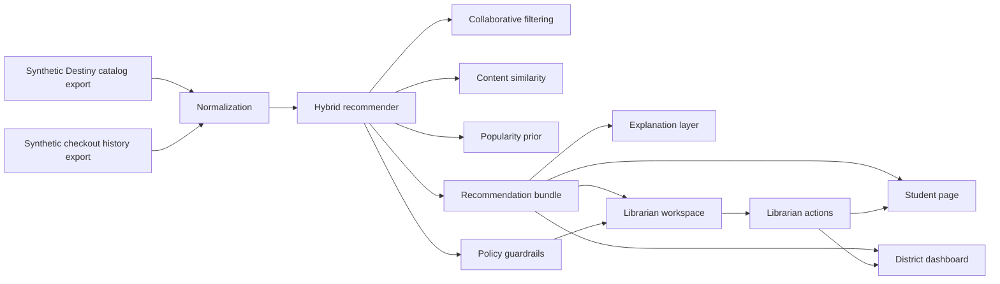

# Qvest Interview


## Prompt
You are an engineering leader in a consulting organization. There is a desire to provide support to a school district to increase the number of books that the students are reading. During initial interviews with librarians, it was noted repeatedly that students would read books that were recommended by the librarian, and they usually relied on anecdotal data about other children enjoying books based on what they read previously.
You are expected to be at an internal meeting with the partners of the firm to present a proposal for a system they could use to increase the number of books the students are reading. The expectation for the content of the proposal would include diagrams describing how it works, and descriptions of how it would be used, rolled out and managed moving forward. Since that is obviously not enough time to have a concrete plan for all those things, we would like to see your best effort for this, as the project picked for this years pro-bono work will be picked from these presentations. Estimates for how long this project would take should also be included.

The librarians have said they could provide the history of books borrowed and also their electronic card catalog.

The partners include both highly technical and non-technical members, skilled in delivery, change management, user experience and software architecture and development. You can expect varying expectations for delivery format from code to slide deck. You know from previous experience that if the technical members are not convinced you have a workable architecture, it will not be approved.

Side note: This is entirely fictional - this is not a real client or scenario.

### Additional Comments

The goal is to demonstrate how you think, communicate, and apply your expertise in applied AI and machine learning to solve the problem. You may recommend any approach you believe is effective; however, we encourage incorporating Large Language Models (LLMs) in a meaningful way, as many of our applied AI solutions leverage them. We want to see that you've thoughtfully considered your approach and can clearly explain your rationale, trade-offs, and any alternatives you explored. While we expect and encourage the use of AI tools in preparing your submission, you should fully understand — and be prepared to explain — the reasoning behind every line of code and each decision made. Runnable code is required. It does not need to be production-grade, but it should be clear, well-structured, and illustrative of your core approach. Include architectural diagrams to show your design choices. Bonus points are awarded for a working proof-of-concept or application, especially if you can walk us through the implementation in detail.

## Proof of Concept

This repo now includes a runnable local proof of concept for the Fulton County Reading Lift pilot in `reading_lift_poc/`.

What it demonstrates:

- Synthetic Destiny-style catalog and checkout data for multiple middle schools
- A nightly batch recommendation pipeline with collaborative filtering, content similarity, popularity priors, and policy guardrails
- Plain-English recommendation explanations with an optional OpenAI-backed explanation path and a deterministic local fallback
- A Streamlit demo with three role-based surfaces: student, librarian, and district leader
- Librarian approve, pin, suppress, and replace actions that change the student view live in the demo session
- Dashboard metrics covering exposure, approval, override behavior, and modeled checkout lift

Run it locally:

```bash
python3 -m venv .venv
source .venv/bin/activate
python3 -m pip install -r requirements.txt
streamlit run reading_lift_poc/app.py
```

Run the tests:

```bash
python3 -m pytest
```

Optional LLM explanation mode:

- Set `OPENAI_API_KEY`
- Set `USE_OPENAI_EXPLANATIONS=1`

The default path remains fully local and does not send student data anywhere.

Architecture summary:

