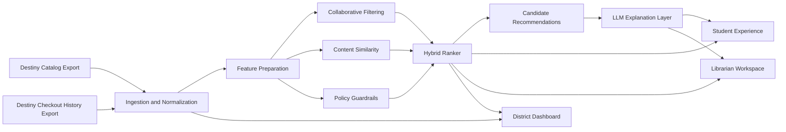

# Fulton County Reading Lift Pilot

## Executive Summary

Fulton County Schools already has two high-value assets for improving reading engagement: librarian trust and Destiny Library Manager data. The gap is that recommendations are currently driven mostly by individual anecdotal knowledge rather than district-scale borrowing patterns.

This proposal introduces a middle-school pilot that uses existing Destiny exports to generate personalized book recommendations for students, keeps librarians in the loop for trust and quality control, and gives district leadership a measurable view of whether the intervention increases books checked out per student.

The proposed solution is a hybrid recommendation platform with four layers:

1. Collaborative filtering to identify books borrowed by similar students.
2. Content-based similarity to recommend books with related themes, genres, or difficulty.
3. Policy guardrails to enforce grade-band and district suitability constraints.
4. LLM-generated explanations to make recommendations understandable to students and librarians.

This is intentionally designed as an augmentation to Destiny, not a replacement for it.

## Problem Statement

The district wants to increase the number of books students are reading. Librarians report that students often respond well to librarian recommendations, but those recommendations are often based on personal experience rather than system-wide evidence.

The district can provide:

- Library checkout history
- Electronic catalog data from Destiny Library Manager

That creates an opportunity to build a practical AI-assisted recommendation system that can:

- Increase books checked out per student
- Help librarians make faster, more data-informed recommendations
- Avoid introducing a separate, standalone library platform
- Provide district leadership with measurable pilot results

## Proposed Pilot Scope

The first version should be a middle-school pilot.

Why middle school:

- Students have enough borrowing behavior to support personalization.
- Librarians still strongly influence reading choices.
- Reading identity is still forming, so recommendation quality can materially change behavior.
- The pilot is narrow enough to measure within one semester.

Primary success metric:

- Increase books checked out per student across pilot schools versus a pre-pilot baseline.

Secondary success metrics:

- Librarian approval rate of AI-generated recommendations
- Percentage of students who receive at least one recommendation
- Recommendation click-through or save rate in the student experience
- Time saved for librarians when creating personalized reading suggestions

## Pilot Non-Goals

The following are explicitly out of scope for the initial pilot:

- Replacing Destiny Library Manager or changing how books are cataloged
- Real-time recommendations; all recommendations run in nightly batch
- Recommendations for elementary or high school students
- Parent-facing views or parental controls
- Integration with student information systems beyond what Destiny already exposes
- AI-generated reading assessments or Lexile-based proficiency tracking

These are deferred to keep the pilot small enough to measure and deliver within one semester.

## Evaluation Methodology

The primary metric is books checked out per student per week, measured against a pre-pilot baseline.

Evaluation structure:

- Baseline window: the same semester one year prior, at the same pilot schools
- Treatment window: the pilot semester
- Comparison group: non-pilot middle schools with similar prior checkout rates, tracked in parallel
- Exposure design: stagger rollout across pilot schools in two waves, or randomize recommendation exposure at the homeroom level within pilot schools if district operations prefer all schools to participate
- Minimum detectable effect: a 10 percent lift in checkout rate, sustained over at least 6 weeks

Threats to validity and controls:

- Seasonality: compare against the same calendar window in the prior year
- Librarian effort confound: track AI-driven recommendation volume separately from direct librarian suggestions and log whether a recommendation was auto-published, approved, pinned, or manually replaced
- Selection bias: choose pilot schools based on typical checkout rates, not top performers
- Early dropout: measure recommendation-to-checkout conversion, not just recommendation generation volume
- Uneven exposure: measure the percentage of students who were actually shown recommendations, not just the percentage for whom recommendations were generated

Midpoint evaluation at week 6. If checkout lift is below 5 percent and librarian approval rate is below 50 percent, pause and re-examine recommendation quality before the semester ends.

This matters because recommendation generation is not the same thing as recommendation exposure. The district needs to know whether the system changed student behavior, not just whether the nightly batch ran successfully.

## Core User Experience

The demo should start with the student experience because that is the emotional hook. It should then move into librarian oversight and district measurement because that is what makes the system approvable.

### 1. Student Recommendation Experience

A student opens a recommendation page and sees:

- Top 5 recommended books
- Plain-English explanations for each recommendation
- A mix of familiar and adjacent reading choices
- Optional “because you liked...” framing

Example:

"Because you checked out The Giver and other students who liked thoughtful dystopian stories also borrowed Scythe, you may enjoy this next."

### Student Access and Distribution

The student experience should not rely on students discovering a new standalone application on their own. For the pilot, recommendation delivery should use one of two district-aligned entry points:

- A ClassLink tile that opens the recommendation page directly
- A Destiny-linked recommendation entry point surfaced from the existing library workflow where feasible

For the pilot, the safest default is a ClassLink launch because it fits existing district access patterns and avoids creating a separate identity silo. Librarians should also be able to distribute direct links to a homeroom or reading group for targeted adoption during the first weeks of the pilot.

### 2. Librarian Review Workspace

The librarian can:

- Search for a student or homeroom
- Review recommended titles
- See why a title was suggested
- Remove, replace, or pin recommendations
- Preserve human judgment and local context

### 3. District Leadership Dashboard

District leaders can see:

- Pilot schools and adoption rates
- Recommendation volume
- Librarian approval rates
- Checkout lift by school, grade, and time period
- Early signals of which recommendation strategies are working

## Proposed Architecture

### High-Level Flow



### Components

#### 1. Ingestion and Normalization

Inputs:

- Destiny catalog export
- Destiny checkout history export

Responsibilities:

- Normalize book metadata
- Normalize borrowing events
- Map books to genres, grade bands, series, and difficulty proxies
- Produce a clean dataset for recommendation and reporting

The ingestion design should assume metadata quality will be uneven across schools and titles. The pilot should define required fields, optional fields, and fallback behavior up front rather than discovering those gaps after the ranker is already designed.

#### 2. Feature Preparation

Responsibilities:

- Build student-book interaction matrices
- Derive popularity and co-borrow signals
- Generate text/content vectors from catalog descriptions and metadata
- Create rule attributes such as grade band and series continuity

Fallback mode if exports are sparse:

- If catalog descriptions are missing, use title, author, subject headings, and series metadata only
- If series or grade-band fields are missing, fall back to librarian-maintained rules for pilot schools
- If content signals are too weak for a student, blend collaborative filtering with school-level popularity priors instead of forcing low-confidence semantic matches

This keeps the hybrid design resilient even if Destiny exports are thinner than the ideal schema.

#### 3. Hybrid Recommendation Engine

Responsibilities:

- Use collaborative filtering for “students like you also borrowed” logic
- Use content similarity for cold start and discovery
- Fuse both signals into a ranked result set
- Filter titles through district and grade-level constraints

#### 4. LLM Explanation Layer

Responsibilities:

- Turn ranked results into short explanations
- Make recommendations legible to students and librarians
- Improve trust without allowing the LLM to control ranking

#### 5. Experience Layer

Surfaces:

- Student recommendation page
- Librarian recommendation review interface
- District metrics dashboard

#### 6. Recommendation Lifecycle

Recommendations run in nightly batch. This keeps inference costs predictable, avoids real-time latency requirements, and gives librarians time to review before students see anything.

```
Nightly Destiny Export
        │
        ▼
  Ingestion & Normalization
        │
        ▼
  Feature Preparation (incremental update)
        │
        ▼
  Hybrid Ranker  ──── produces candidate set per student
        │
        ▼
  LLM Explanation Generator  ──── batch, top 10 candidates per student
        │
        ▼
  Librarian Review Queue  ──── required for flagged items, sampled for quality review, bypassed for high-confidence low-risk items
        │
        ├── Approved    ──→ Student Display
        ├── Overridden  ──→ Replacement surfaced, original logged
        ├── Pinned      ──→ Promoted to top of student list
        └── Auto-Published  ──→ Student Display, marked for later audit
```

Policy for the pilot:

- High-confidence recommendations that pass grade-band and district guardrails auto-publish nightly
- Low-confidence recommendations, first-time recommendations for a student, and any policy-edge cases enter the librarian review queue
- Librarian actions, approval rate, override rate, and pin rate are all logged as quality signals in the district dashboard

This avoids blocking the entire student experience on daily manual review while still keeping librarians in the loop where human judgment is most valuable.

## Why a Hybrid Approach

Collaborative filtering was the right first instinct. It should remain the primary behavioral signal. But by itself, it is not enough.

Limitations of collaborative filtering alone:

- New books have no interaction history.
- Students with sparse borrowing history get weak recommendations.
- Pure similarity scores are difficult for staff to explain.
- District leadership needs guardrails and governance, not just relevance.

The hybrid design fixes that:

- Collaborative filtering gives behavioral relevance.
- Content similarity covers cold start and discovery.
- Guardrails handle policy and suitability.
- LLM explanations increase transparency and usability.

## Alternatives Considered

Three approaches were evaluated before settling on the hybrid design.

### Option A: Pure LLM Recommendations

Ask the LLM to recommend books directly given a student's borrowing history.

Rejected for three reasons:

First, context window limits make this unworkable at district scale. Fulton County has 19 middle schools, a catalog of thousands of titles, and borrowing histories spanning years. Fitting even a fraction of the catalog and a student's full history into a prompt is not feasible. You would have to aggressively truncate both, which defeats the purpose. LLMs are not designed to rank over large, bounded inventories.

Second, collaborative filtering is the proven approach for exactly this problem. Decades of production recommendation systems at Amazon, Netflix, Spotify, and library software vendors are built on user-item interaction matrices, not language model prompts. When the task is "given what this person consumed, predict what they will consume next from a fixed catalog," collaborative filtering scales to millions of users and millions of items with well-understood performance characteristics. An LLM prompt does not.

Third, LLMs have no knowledge of the district catalog. They will recommend titles Destiny does not hold, titles outside the grade band, and titles skewed by training data toward popular or widely-reviewed books rather than what the district actually has on shelves. The LLM is excellent at explanation. Ranking is not its job here.

### Option B: Pure Collaborative Filtering

Rank recommendations using only co-borrow patterns, no content signals.

Rejected because: this approach collapses for new students with fewer than three to five checkouts and for newly acquired titles with no borrowing history. A meaningful share of students at any given time will have too little history to generate quality collaborative recommendations. This is not a tail case; it is a structural property of middle-school library usage.

### Option C: Librarian Rule Engine

Allow librarians to configure rules: if a student checks out genre X, recommend series Y.

Rejected as the primary signal because: rules do not scale across 19 middle schools and tens of thousands of students. The value of this system is surfacing patterns a librarian could not discover manually. A rule engine recreates the anecdotal recommendation problem we are trying to solve. Rules remain valuable as guardrails layered on top of ranked results.

## Recommended Tech Stack

For the proof of concept:

- Backend API: FastAPI
- Data processing: pandas
- Recommender logic: scikit-learn plus custom ranking logic
- Embeddings / semantic similarity: sentence-transformers or hosted embeddings
- Vector index: FAISS or Chroma
- Persistence: SQLite or DuckDB
- UI: Streamlit
- LLM SDK: OpenAI or Anthropic

Why this stack:

- It aligns well with a modern Applied AI / ML consulting workflow.
- It is fast to implement and explain.
- It demonstrates real AI architecture decisions without overbuilding.
- It gives a clean path to a more enterprise-ready production implementation later.

## Production Evolution Path

If the pilot succeeds, the system can mature into a production service without changing the core design.

Likely production upgrades:

- Managed PostgreSQL plus `pgvector`
- Scheduled ingestion pipeline from district data exports or approved APIs
- AuthN/AuthZ aligned with district identity systems
- Recommendation service deployed behind standard API infrastructure
- Observability, audit logging, and approval workflows
- School-level and district-level analytics with role-based access

This framing matters because it shows the solution is credible at pilot scale and extensible at enterprise scale.

## District Authentication Integration

This system is not a third-party application. It is internal IP delivered inside the district's infrastructure. Authentication must be treated as a first-class production concern, not an afterthought.

The proof of concept is intentionally unauthenticated. It runs locally against synthetic data and does not expose a network-accessible service. Auth is out of scope for the POC.

For the pilot and beyond, authentication must integrate with what the district already operates:

- Fulton County Schools runs Microsoft 365 district-wide under an enterprise agreement. The pilot application should use OAuth 2.0 / OIDC with Microsoft Entra ID (formerly Azure AD) as the identity provider, restricting login to `@fcstu.org` accounts.
- Students access district applications via ClassLink at `launchpad.classlink.com/fcs`. The pilot should integrate with ClassLink SSO where possible so it appears as a native district application rather than a separate login destination.
- Role assignment (student, librarian, district admin) should derive from Entra ID groups or directory attributes, not from a separate user management system maintained by the pilot.
- Session tokens should be short-lived. There is no reason for a librarian session to persist more than a single workday.
- The district dashboard is a higher-sensitivity surface than the student recommendation page. It should require explicit admin role assignment, not just a valid district account.

Single sign-on alignment is also a strategic requirement. Dr. Phillips has a documented track record of reducing application sprawl: from roughly 7,850 systems to fewer than 500 at a prior district. A system that introduces its own identity silo will trigger immediate skepticism. Fitting into existing SSO is a prerequisite for adoption, not a bonus.

For production hardening, the specific integration points are:

- OAuth 2.0 / OIDC against the district Microsoft Entra ID tenant, scoped to `@fcstu.org`
- Role-to-group mapping via Entra ID security groups
- ClassLink SSO integration so the application surfaces natively in the student and staff launchpad
- No local password storage; all credential management stays with the identity provider
- API endpoints protected by JWT with district-issued claims

## Data Governance and Privacy Posture

Student privacy is the highest-stakes constraint on this system. Five controls manage it:

1. **De-identified student identifiers.** The recommendation pipeline never operates on student names, email addresses, or externally assigned IDs. A randomized surrogate key maps to Destiny records internally. The display layer resolves names only at rendering time, scoped to the requesting librarian's school.

2. **LLM prompt boundary.** LLM calls receive only book metadata: title, author, genre, catalog description, and series. No student identifiers, individual borrowing history, or demographic data are included in prompts. The model explains why a book fits a pattern, not why a specific student was selected.

3. **Data locality.** During the proof of concept, all computation runs locally against synthetic data. During the pilot, exports stay within district-controlled infrastructure. Requests to external LLM API endpoints contain no student data.

4. **Role-scoped access.** Librarians see recommendations for students enrolled at their school only. District dashboard users see aggregate metrics with no student-level drill-down. Overrides and approvals are logged with librarian identity and timestamp for audit purposes.

5. **Minimal but auditable retention.** Raw export files are processed and deleted after normalization. The system retains a de-identified normalized interaction table, ranked candidates, explanations, and librarian actions for a bounded retention window so recommendation quality can be audited, reproduced, and improved without exposing student identity in the modeling pipeline.

Recommended pilot retention policy:

- Raw source exports deleted after successful normalization and validation
- De-identified interaction events retained for the pilot semester plus one comparison semester
- Recommendation decisions and librarian actions retained through pilot evaluation and closeout reporting
- Student identity resolution kept outside the modeling tables and only available in the display layer under role-based access

## Operating Model

This system should not replace librarians. It should make their judgment more scalable.

Recommended ownership model:

- District technology team owns ingestion, operations, and integration.
- Librarians own recommendation oversight and local curation.
- School leadership owns adoption at the campus level.
- District leadership owns pilot evaluation and expansion decisions.

## Rollout Plan

### Phase 0: Discovery and Data Validation, 2 weeks

- Confirm available Destiny export fields
- Confirm privacy constraints and approved identifiers
- Choose 3 to 5 middle schools for the pilot
- Define the baseline for books checked out per student
- Validate the real student access path, ClassLink launch, Destiny link, or both, before UI work begins
- Confirm which metadata fields are consistently populated enough to support content similarity without manual cleanup

### Phase 1: Pilot Build, 4 to 6 weeks

- Build ingestion pipeline
- Implement hybrid recommendation engine
- Stand up student, librarian, and district-facing demo surfaces
- Validate recommendation quality with librarians
- Instrument exposure logging, recommendation state changes, and checkout attribution from the start

### Phase 2: Pilot Operation, 8 to 12 weeks

- Run recommendations during the semester
- Monitor adoption and checkout lift
- Tune thresholds, ranking, and explanations
- Collect qualitative feedback from librarians and students

### Phase 3: Expansion Decision, 2 weeks

- Review pilot performance
- Decide whether to expand to more schools
- Confirm production hardening priorities

## Timeline Estimate

### Proof of Concept for the interview

- Synthetic data generation: 2 to 3 hours
- Recommendation engine and API: 4 to 5 hours
- Student and dashboard demo UI: 3 to 4 hours
- Diagramming, narrative, and polish: 2 to 3 hours

Total: roughly 12 to 15 hours

## Proof of Concept Deliverable Definition

The interview brief asks for runnable code, not just a plausible architecture. The proof of concept should therefore be framed as a concrete local demo with clear acceptance criteria.

Local deliverables:

- Synthetic catalog and checkout dataset representing multiple middle schools, multiple grades, and both dense-history and sparse-history students
- A batch recommendation pipeline that produces top recommendations per student with collaborative, content, and guardrail signals visible in the output
- A student-facing page showing top recommendations and plain-English explanations
- A librarian page showing approve, replace, and pin actions for a selected student or homeroom
- A district dashboard showing recommendation volume, exposure rate, librarian action rates, and mock checkout lift metrics

Acceptance criteria:

- A single local setup path loads synthetic data, runs the batch job, and starts the demo application
- At least one student demonstrates a collaborative-filtering-driven recommendation
- At least one student demonstrates a cold-start fallback recommendation path
- At least one recommendation is blocked by a policy guardrail and surfaced as such in logs or debug output
- Librarian override and pin actions change what the student page displays
- Dashboard metrics reflect recommendation exposure and librarian actions, not just recommendation generation

Suggested verification tests:

- Unit tests for ingestion normalization, hybrid ranker scoring, cold-start fallback, and guardrail filtering
- A lightweight integration test that runs the nightly batch on synthetic data and verifies recommendations are produced for at least one dense-history and one sparse-history student
- A UI smoke test that verifies student, librarian, and dashboard views render from the generated dataset

### Real pilot delivery estimate

- Discovery and alignment: 2 weeks
- Implementation and validation: 4 to 6 weeks
- Pilot execution window: 8 to 12 weeks

Total: 14 to 20 weeks including measurement window

## Risks and Mitigations

### Risk: Poor recommendation quality with sparse data

Mitigation:

- Use content-based similarity and popularity priors for cold start
- Start with middle schools where interaction density is better

### Risk: Low staff trust in AI recommendations

Mitigation:

- Keep librarians in the review loop
- Show recommendation provenance and explanations
- Position AI as assistive, not authoritative

### Risk: Privacy and governance concerns

Mitigation:

- Use minimal student attributes
- Prefer de-identified IDs in the recommendation pipeline
- Apply grade-band and suitability guardrails before display

### Risk: District concern about app sprawl

Mitigation:

- Frame the system as an augmentation to Destiny
- Use exports and lightweight integration rather than introducing a replacement platform

## Why This Will Land With Dr. Joe Phillips

This proposal matches the priorities of a district strategy and technology leader:

- It improves outcomes without requiring a platform replacement.
- It uses existing operational data.
- It has a clear governance and change-management story.
- It can be piloted, measured, and scaled deliberately.
- It avoids unnecessary technical sprawl.

The key pitch is simple:

"We can use data Fulton already has in Destiny to increase student book checkouts, keep librarians in control, and give district leadership measurable pilot results within one semester."

## Recommendation

Move forward with a repo-local proof of concept that demonstrates:

1. A student-facing recommendation experience
2. A librarian oversight workflow
3. A district dashboard with pilot metrics

Use a hybrid recommendation architecture with collaborative filtering as the core behavioral signal, enhanced by content similarity, policy guardrails, and LLM-generated explanations.

That is the strongest balance of technical credibility, delivery realism, and interview impact.