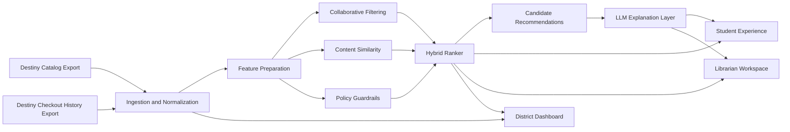

# Fulton County Reading Lift Pilot

## Executive Summary

Fulton County Schools already has two high-value assets for improving reading engagement: librarian trust and Destiny Library Manager data. The gap is that recommendations are currently driven mostly by individual anecdotal knowledge rather than district-scale borrowing patterns.

This proposal introduces a middle-school pilot that uses existing Destiny exports to generate personalized book recommendations for students, keeps librarians in the loop for trust and quality control, and gives district leadership a measurable view of whether the intervention increases books checked out per student.

The proposed solution is a hybrid recommendation platform with four layers:

1. Collaborative filtering to identify books borrowed by similar students.
2. Content-based similarity to recommend books with related themes, genres, or difficulty.
3. Policy guardrails to enforce grade-band and district suitability constraints.
4. LLM-generated explanations to make recommendations understandable to students and librarians.

This is intentionally designed as an augmentation to Destiny, not a replacement for it.

## Problem Statement

The district wants to increase the number of books students are reading. Librarians report that students often respond well to librarian recommendations, but those recommendations are often based on personal experience rather than system-wide evidence.

The district can provide:

- Library checkout history
- Electronic catalog data from Destiny Library Manager

That creates an opportunity to build a practical AI-assisted recommendation system that can:

- Increase books checked out per student
- Help librarians make faster, more data-informed recommendations
- Avoid introducing a separate, standalone library platform
- Provide district leadership with measurable pilot results

## Proposed Pilot Scope

The first version should be a middle-school pilot.

Why middle school:

- Students have enough borrowing behavior to support personalization.
- Librarians still strongly influence reading choices.
- Reading identity is still forming, so recommendation quality can materially change behavior.
- The pilot is narrow enough to measure within one semester.

Primary success metric:

- Increase books checked out per student across pilot schools versus a pre-pilot baseline.

Secondary success metrics:

- Librarian approval rate of AI-generated recommendations
- Percentage of students who receive at least one recommendation
- Recommendation click-through or save rate in the student experience
- Time saved for librarians when creating personalized reading suggestions

## Core User Experience

The demo should start with the student experience because that is the emotional hook. It should then move into librarian oversight and district measurement because that is what makes the system approvable.

### 1. Student Recommendation Experience

A student opens a recommendation page and sees:

- Top 5 recommended books
- Plain-English explanations for each recommendation
- A mix of familiar and adjacent reading choices
- Optional “because you liked...” framing

Example:

"Because you checked out The Giver and other students who liked thoughtful dystopian stories also borrowed Scythe, you may enjoy this next."

### 2. Librarian Review Workspace

The librarian can:

- Search for a student or homeroom
- Review recommended titles
- See why a title was suggested
- Remove, replace, or pin recommendations
- Preserve human judgment and local context

### 3. District Leadership Dashboard

District leaders can see:

- Pilot schools and adoption rates
- Recommendation volume
- Librarian approval rates
- Checkout lift by school, grade, and time period
- Early signals of which recommendation strategies are working

## Proposed Architecture

### High-Level Flow

### Components

#### 1. Ingestion and Normalization

Inputs:

- Destiny catalog export
- Destiny checkout history export

Responsibilities:

- Normalize book metadata
- Normalize borrowing events
- Map books to genres, grade bands, series, and difficulty proxies
- Produce a clean dataset for recommendation and reporting

#### 2. Feature Preparation

Responsibilities:

- Build student-book interaction matrices
- Derive popularity and co-borrow signals
- Generate text/content vectors from catalog descriptions and metadata
- Create rule attributes such as grade band and series continuity

#### 3. Hybrid Recommendation Engine

Responsibilities:

- Use collaborative filtering for “students like you also borrowed” logic
- Use content similarity for cold start and discovery
- Fuse both signals into a ranked result set
- Filter titles through district and grade-level constraints

#### 4. LLM Explanation Layer

Responsibilities:

- Turn ranked results into short explanations
- Make recommendations legible to students and librarians
- Improve trust without allowing the LLM to control ranking

#### 5. Experience Layer

Surfaces:

- Student recommendation page
- Librarian recommendation review interface
- District metrics dashboard

## Why a Hybrid Approach

Collaborative filtering was the right first instinct. It should remain the primary behavioral signal. But by itself, it is not enough.

Limitations of collaborative filtering alone:

- New books have no interaction history.
- Students with sparse borrowing history get weak recommendations.
- Pure similarity scores are difficult for staff to explain.
- District leadership needs guardrails and governance, not just relevance.

The hybrid design fixes that:

- Collaborative filtering gives behavioral relevance.
- Content similarity covers cold start and discovery.
- Guardrails handle policy and suitability.
- LLM explanations increase transparency and usability.

## Recommended Tech Stack

For the proof of concept:

- Backend API: FastAPI
- Data processing: pandas
- Recommender logic: scikit-learn plus custom ranking logic
- Embeddings / semantic similarity: sentence-transformers or hosted embeddings
- Vector index: FAISS or Chroma
- Persistence: SQLite or DuckDB
- UI: Streamlit
- LLM SDK: OpenAI or Anthropic

Why this stack:

- It aligns well with a modern Applied AI / ML consulting workflow.
- It is fast to implement and explain.
- It demonstrates real AI architecture decisions without overbuilding.
- It gives a clean path to a more enterprise-ready production implementation later.

## Production Evolution Path

If the pilot succeeds, the system can mature into a production service without changing the core design.

Likely production upgrades:

- Managed PostgreSQL plus `pgvector`
- Scheduled ingestion pipeline from district data exports or approved APIs
- AuthN/AuthZ aligned with district identity systems
- Recommendation service deployed behind standard API infrastructure
- Observability, audit logging, and approval workflows
- School-level and district-level analytics with role-based access

This framing matters because it shows the solution is credible at pilot scale and extensible at enterprise scale.

## Operating Model

This system should not replace librarians. It should make their judgment more scalable.

Recommended ownership model:

- District technology team owns ingestion, operations, and integration.
- Librarians own recommendation oversight and local curation.
- School leadership owns adoption at the campus level.
- District leadership owns pilot evaluation and expansion decisions.

## Rollout Plan

### Phase 0: Discovery and Data Validation, 2 weeks

- Confirm available Destiny export fields
- Confirm privacy constraints and approved identifiers
- Choose 3 to 5 middle schools for the pilot
- Define the baseline for books checked out per student

### Phase 1: Pilot Build, 4 to 6 weeks

- Build ingestion pipeline
- Implement hybrid recommendation engine
- Stand up student, librarian, and district-facing demo surfaces
- Validate recommendation quality with librarians

### Phase 2: Pilot Operation, 8 to 12 weeks

- Run recommendations during the semester
- Monitor adoption and checkout lift
- Tune thresholds, ranking, and explanations
- Collect qualitative feedback from librarians and students

### Phase 3: Expansion Decision, 2 weeks

- Review pilot performance
- Decide whether to expand to more schools
- Confirm production hardening priorities

## Timeline Estimate

### Proof of Concept for the interview

- Synthetic data generation: 2 to 3 hours
- Recommendation engine and API: 4 to 5 hours
- Student and dashboard demo UI: 3 to 4 hours
- Diagramming, narrative, and polish: 2 to 3 hours

Total: roughly 12 to 15 hours

### Real pilot delivery estimate

- Discovery and alignment: 2 weeks
- Implementation and validation: 4 to 6 weeks
- Pilot execution window: 8 to 12 weeks

Total: 14 to 20 weeks including measurement window

## Risks and Mitigations

### Risk: Poor recommendation quality with sparse data

Mitigation:

- Use content-based similarity and popularity priors for cold start
- Start with middle schools where interaction density is better

### Risk: Low staff trust in AI recommendations

Mitigation:

- Keep librarians in the review loop
- Show recommendation provenance and explanations
- Position AI as assistive, not authoritative

### Risk: Privacy and governance concerns

Mitigation:

- Use minimal student attributes
- Prefer de-identified IDs in the recommendation pipeline
- Apply grade-band and suitability guardrails before display

### Risk: District concern about app sprawl

Mitigation:

- Frame the system as an augmentation to Destiny
- Use exports and lightweight integration rather than introducing a replacement platform

## Why This Will Land With Dr. Joe Phillips

This proposal matches the priorities of a district strategy and technology leader:

- It improves outcomes without requiring a platform replacement.
- It uses existing operational data.
- It has a clear governance and change-management story.
- It can be piloted, measured, and scaled deliberately.
- It avoids unnecessary technical sprawl.

The key pitch is simple:

"We can use data Fulton already has in Destiny to increase student book checkouts, keep librarians in control, and give district leadership measurable pilot results within one semester."

## Recommendation

Move forward with a repo-local proof of concept that demonstrates:

1. A student-facing recommendation experience
2. A librarian oversight workflow
3. A district dashboard with pilot metrics

Use a hybrid recommendation architecture with collaborative filtering as the core behavioral signal, enhanced by content similarity, policy guardrails, and LLM-generated explanations.

That is the strongest balance of technical credibility, delivery realism, and interview impact.